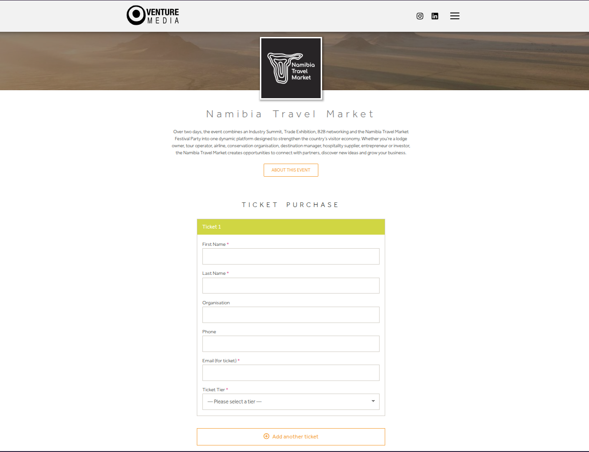

# Venture Events

WordPress plugin for event registration, payment gateways, Zoho Books invoicing, and QR-code tickets.

## Features

- Custom **Events** post type with configurable ticket tiers
- Frontend registration form (`[venture_registration event_id="123"]`)
- Pluggable payment gateways (register via `ve_register_gateways`)
- Zoho Books contacts, invoices, and customer payments
- QR tickets emailed after successful payment
- Guest list and gate check-in (`/read-qr/`)

## Requirements

- WordPress with a working mail setup for ticket emails
- A companion gateway plugin (coming soon)
- Zoho Books OAuth app + organization for invoicing

## Setup

1. Install and activate **Venture Events**.
2. Create an event, set tiers and prices, place the shortcode on a page.
3. Configure **Events → Settings**: Zoho client ID/secret, refresh token, org ID, optional tax/salesperson/line-account IDs, ticket From address.
4. Activate and configure a payment gateway plugin that hooks into Venture Events.

## License

MIT — see [License.md](License.md).  
phpqrcode is bundled under LGPL v3 — see [Third-party libraries.md](Third-party%20libraries.md).
